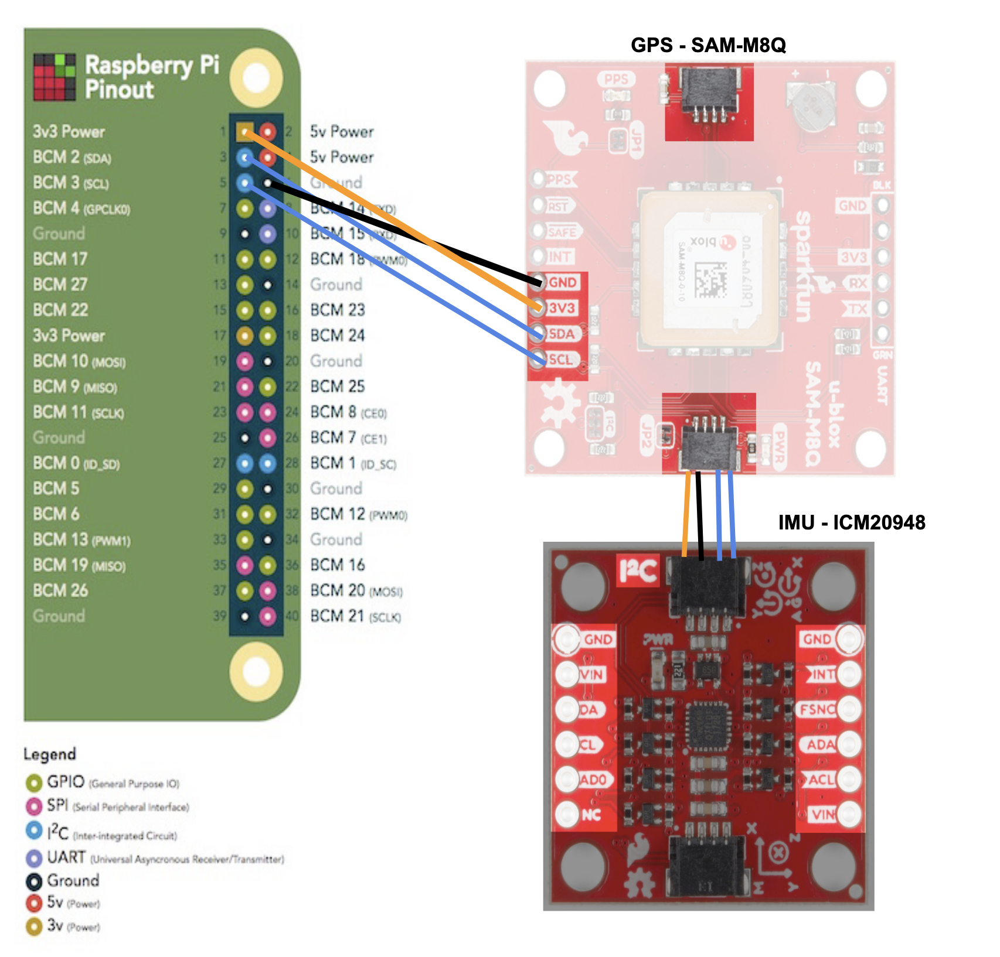

# GPS and IMU C/C++ Driver for Rover

This repository houses a robust C/C++ driver designed for GPS and IMU module interfacing within rover projects. Originally inspired by Python implementations, this project aims to offer high-performance, easy-to-integrate drivers for critical navigation components.

## Features

- **High-Performance C++ Drivers**: Conversion of Python GPS and IMU code to C++, optimizing speed and efficiency for real-time applications.
- **Code Quality Assurance**: Incorporation of Git pre-commit hooks to enforce coding standards and ensure high-quality commits.
- **Extensive Sensor Support**: Compatibility with popular GPS and IMU modules, facilitating a wide range of rover designs and applications.

## Getting Started

### Prerequisites (Installed with setup.sh)

Ensure you have the following tools installed:
- Git
- g++
- Eigen3 (for Kalman Filter calculations)
- I2C tools and libraries (for communication with sensors)

### Setup

1. **Clone the Repository**: Fork and clone the repository to get your own local copy for development.

    ```bash
    git clone https://github.com/<your-username>/GPS_IMU_C_Driver.git
    cd GPS_IMU_C_Driver
    ```

2. **Install Dependencies**: Run the `setup.sh` script to configure your development environment, including the installation of pre-commit hooks and necessary libraries.

    ```bash
    ./setup.sh
    ```

3. **Build the Drivers**: Utilize the Makefile for compiling the drivers and tests.

    ```bash
    make all
    ```

### Testing

Execute the tests to verify the correct operation of GPS and IMU modules:
- `make imu_test` for IMU functionality testing.
  - Execute with 
      ```bash
      ./imu_test
      ```
- `make gps_test` for GPS functionality testing.
  - Execute with 
      ```bash
      ./gps_test
      ```
- `make kalman_test` for integrating GPS and IMU data using the Kalman Filter.
  - Execute with 
      ```bash
      ./kalman_test
      ```
Refer to the `tests/` directory for additional testing and calibration tools.

## Project Structure

The project is organized into several key directories and files:

- `src/`: Source files for the GPS and IMU drivers, and utilities like UBX message parsing and Kalman Filter implementation.
- `tests/`: Test programs for individual modules and integrated systems.
- `include/`: Header files for the project, defining interfaces and shared constants.
- `Makefile`: Scripts for compiling the project and tests, managing dependencies, and cleaning build artifacts.

## Documentation

### Hardware Specifications

- **GPS**: ZOE M8Q Board - [Datasheet](https://www.mouser.com/datasheet/2/813/ZOE_M8_HIM__UBX_16030136_-2487913.pdf)
    - UBX Protocol - [Datasheet](https://docs.rs-online.com/8e7c/0900766b815aef70.pdf)
- **IMU**: ICM-20948 - [Datasheet](https://invensense.tdk.com/download-pdf/icm-20948-datasheet/)

### Libraries

- **GPS Module Libraries**:
  - SparkFun Arduino I2C with UBX Library Used for Basing C++ Implementation: [GitHub](https://github.com/sparkfun/SparkFun_Ublox_Arduino_Library)
  - GPS SAM-M8Q Library (Python) Used for Basing C++ Implementation: [Melopero SAM-M8Q Module GitHub](https://github.com/melopero/Melopero_SAM-M8Q/blob/master/README.md)
- **IMU Module Libraries**:
  - IMU SparkFun Library Used for Basing C++ Implementation: [GitHub](https://github.com/sparkfun/SparkFun_ICM-20948_ArduinoLibrary/blob/main/src/ICM_20948.h#L34)
  - Old Rover Code for IMU: [Rover IMU Code Old](https://github.com/GoScoutOrg/Rover/blob/main/src/rover/imu.py#L23)
- **Kalman Filter Libraries**
  - Kalman Filter Library Used: [GitHub](https://github.com/balamuruganky/ekf_nav_ins/tree/fa8c6bcd15344f4155cac6e13f0d9576d70f7074)
  - Eigen3: [Library](https://eigen.tuxfamily.org/index.php?title=Main_Page)
- **I2C Libraries**:
  - I2C on Raspberry Pi: [I2C on C on Pi](https://raspberrypi.stackexchange.com/questions/33485/using-i2c-in-c-on-raspberry-pi)
  - I2C Library for C/C++/Python: [I2C in C Library](https://www.kernel.org/doc/html/v5.4/i2c/dev-interface.html)

### Additional Notes

- UBX is a communication protocol with specific functions for GPS.
- Commands for interacting with GPS via Python:
  ```bash
  source myenv/bin/activate
  sudo i2cdetect -y <value>  # Checks for live i2c slave address
  cd /home/simba/Desktop/Rover/src

### Wiring Instructions



1. Solder the 3.3V pin from the Raspberry Pi to the 3.3V pin on the GPS module to supply power.
2. Solder a Ground (GND) pin from the Raspberry Pi to the GND pin on the GPS module to establish a common ground.
3. Solder the Serial Clock Line (SCL) pin from the Raspberry Pi to the SCL pin on the GPS module for I2C clock signal.
4. Solder the Serial Data Line (SDA) pin from the Raspberry Pi to the SDA pin on the GPS module for I2C data signal.
5. Use a Qwiic cable to daisy-chain the GPS module to the IMU module:
    - Connect one end of the Qwiic cable to the Qwiic connector on the GPS module.
    - Connect the other end of the Qwiic cable to the Qwiic connector on the IMU module.
    - Ensure that the GPS and IMU modules have different I2C addresses to avoid conflicts.


### Compiling and Running Tests

To compile and run a specific test, use the corresponding make command outlined in the **Testing** section. Ensure all dependencies are installed and the hardware is correctly connected to your development system.

### Contribution Guidelines

Contributors are encouraged to follow the project's coding standards and submit pull requests for any enhancements, bug fixes, or documentation improvements. See [CONTRIBUTING.md](CONTRIBUTING.md) for detailed guidelines.

## License

This project is licensed under the MIT License - see the [LICENSE](LICENSE) file for details.

## Acknowledgments

- Special thanks to the open-source projects and libraries that provided the foundation and inspiration for this driver suite.
- Gratitude to the community for contributions, bug reports, and suggestions.

We hope this project accelerates your rover development and exploration projects. For any inquiries or contributions, please feel free to reach out or open an issue.
